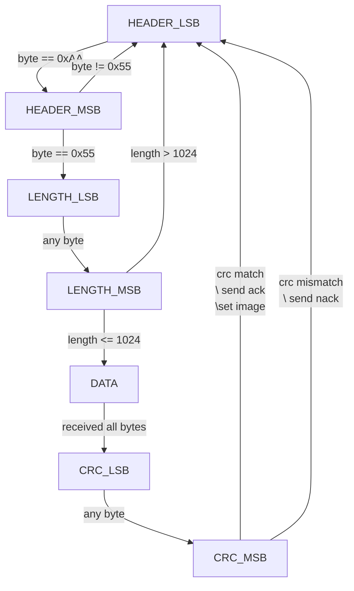

This project is all about giving a little bit of personality to an OLED driver. No particular reason - just pure experimentation. The firmware is a simple controller that receives image data and sends it to the OLED screen. The desktop application is written in Python using PySide6 and provides a gallery of images and animations to send to the device.

## Hardware


### OLED Screen

The [Grove - OLED Display 0.96" (SSD1315)](https://wiki.seeedstudio.com/Grove-OLED-Display-0.96-SSD1315/) is a monochrome 128x64 pixel display.
I removed the 4-pin I2C header and moved it to the back because I didn't want the wires sticking out over the screen.

### Controller

A [Seeed Studio XIAO nRF52840 Sense](https://wiki.seeedstudio.com/XIAO_BLE/) was perfect for this project. It's tiny, has a nice USB interface, and it has several GPIOs to utilize. This board has lots of features that I don't need (BLE, IMU, microphone, battery charging, additional flash, etc.). Maybe in the future I will utilize some of these features, e.g. I could add a battery and use BLE to send images instead of serial USB. 

### Casing

The [casing is 3D printed](https://cad.onshape.com/documents/57535a84b8613a4384fcd9f1/w/855ea2d725360c99a9cd3771/e/f0070173e1d9ac47f211a9f3?renderMode=0&uiState=68d868069bcc8696d0914b52) and only really serves to hide the wires and provide a bit of rigidity. The XIAO nRF52840 Sense is press-fitted so it can be easily removed and repurposed if needed for other projects. The OLED display is held in with a single screw so can also be removed and repurposed.

## Firmware

Most of the functionality was provided by the [olikraus/U8g2](https://github.com/olikraus/u8g2) library. The XIAO nRF52840 Sense is designed for use with Arduino. I am not a fan of the Arduino IDE so I decided to try using PlatformIO, which I had not used before, and was pleasantly surprised to find it was very easy to set up.

### Driver

The driver is simple, most of the actual logic is handled by the library. All I needed to do was initialize a driver instance and draw a bitmap.

```cpp
#include <U8g2lib.h>

static U8G2_SSD1306_128X64_NONAME_F_HW_I2C u8g2(U8G2_R0, /* clock */ SCL, /* data */ SDA, /* reset */ U8X8_PIN_NONE);

void oled_init()
{
    u8g2.begin();
    u8g2.clearBuffer();
    u8g2.setFont(u8g2_font_ncenB12_tr);
}
```

```cpp
oled_set_image_ret_t oled_set_image(const uint8_t *image_data, size_t length)
{
    if (length != OLED_BUFFER_SIZE)
    {
        return OLED_SET_IMAGE_INVALID_LENGTH;
    }
    u8g2.drawXBMP(0, 0, OLED_WIDTH, OLED_HEIGHT, image_data);
    u8g2.sendBuffer();
    return OLED_SET_IMAGE_SUCCESS;
}
```

### Protocol

I created a simple `[header][length][payload][crc]` protocol with the following state machine:



When a full packet is received, it's sent to the OLED driver. 1024 bytes are required because each pixel on the OLED display is a bit. There are 128x64 pixels, which is 8192 pixels, which is 1024 bytes.

### LEDs

I wanted some feedback to know what the feedback was doing, so added some LED states:

- Green when the board is powered and functional
- Blue when the device is receiving a packet
- Red when the OLED image is being set
- White when there is an error (packet CRC doesn't match, or failed to set the image)

## Desktop Application


Simple choose the correct serial port, browse the gallery of 128x64 images, and send to the device.


### Dithering

For images that aren't plain black and white, it's possible to convert to grayscale and use a middle-level threshold to determine if a pixel should be displayed as a black pixel or a white pixel. This doesn't look great for some images, so I added dithering for non-binary images.


I used the [ordered dithering](https://en.wikipedia.org/wiki/Ordered_dithering) algorithm and a 4x4 Bayer matrix.

```py
def dither_pixel(pixel: int, x: int, y: int) -> int:
    # 4x4 Bayer matrix (values scaled 0-15)
    bayer4 = [
        [0, 8, 2, 10],
        [12, 4, 14, 6],
        [3, 11, 1, 9],
        [15, 7, 13, 5],
    ]

    # choose matrix cell
    threshold_map_value = bayer4[y % 4][x % 4]

    # scale Bayer value (0-15) to 0-255
    bayer_threshold = (threshold_map_value + 0.5) * (255 / 16)

    return 1 if pixel < bayer_threshold else 0
```

Dithering proves to be quite effective in creating the illusion of gray pixels:


### Animations

Animations are also possible by defining frames and intervals. The app sets up a timer and sends the frames.
